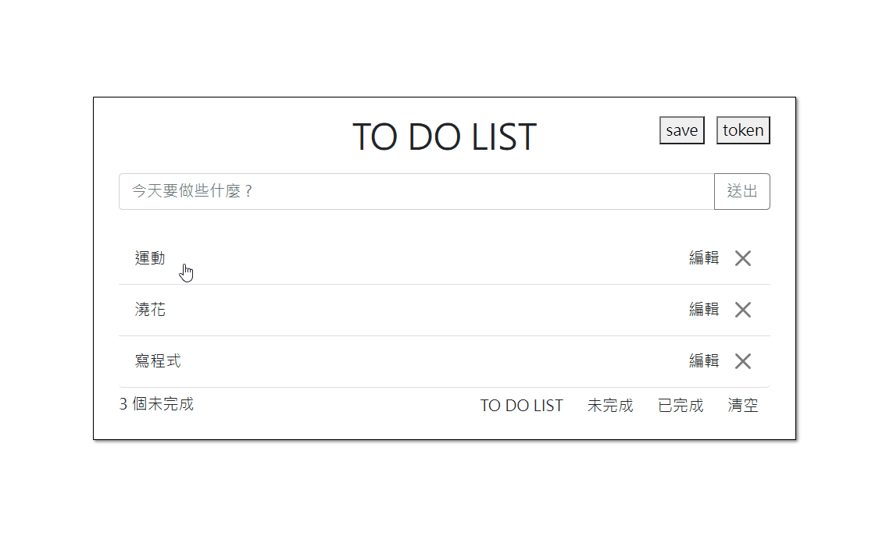

# TodoList
用 PHP 和 Ajax 學習前後端串接。

✨[DEMO](https://todo.ywh15.tw/)

## 功能描述
- 新增、編輯、刪除 todo
- 標記已完成、未完成
- 存取 list

## 前端技術
- HTML 
- CSS
- Bootstrap
- jQuery : 功能互動
- Ajax : 串接 API

## 後端技術
- PHP : 撰寫 API
- MySQL : 資料儲存
